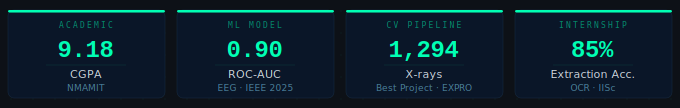

<!-- CUSTOM SVG BANNER — commit banner.svg to this same repo -->

  

<!-- TYPING ANIMATION -->

  

<!-- LINK BUTTONS -->

  &nbsp;
  &nbsp;
  &nbsp;
  

---

<!-- HEADLINE METRICS -->

  

---

### 🛠 Tech stack

<table>
  <tr>
    <th>Languages</th>
    <th>ML / AI</th>
    <th>Backend · Frontend</th>
    <th>DevOps &amp; Cloud</th>
  </tr>
  <tr>
    <td align="center">
      
    </td>
    <td align="center">
      
    </td>
    <td align="center">
      
    </td>
    <td align="center">
      
    </td>
  </tr>
</table>

  &nbsp;
  &nbsp;
  &nbsp;
  &nbsp;
  &nbsp;
  &nbsp;
  &nbsp;
  &nbsp;
  

---

### 🔬 Featured projects

| &nbsp; | Project | What it does | Stack | Result |
|---|---|---|---|---|
| 🦴 | **[Skeletal Age & Gender Prediction](https://github.com/ShettyShravya03/Machine-Learning-Driven-Skeletal-age-and-gender-prediction)** | Full CV pipeline on 1,294 X-rays — Attention U-Net segmentation, SHAP feature selection, deployed via Flask + React | PyTorch · XGBoost · SHAP · Flask · React | 🏆 Best Project EXPRO 2025-26 · Dice 0.94 · AUC 0.912 |
| 🧠 | **[Epileptic Seizure Prediction](https://github.com/ShettyShravya03/Epileptic-Seizure-Prediction-using-EEG-spectrogram)** | Wavelet-CNN-BiLSTM + Attention on CHB-MIT EEG. Grad-CAM clinical interpretability | CNN-BiLSTM · CWT · Grad-CAM | 📄 IEEE COSMIC 2025 · 85% acc · AUC 0.90 |
| 🔬 | **[IISc OCR Pipeline](https://github.com/ShettyShravya03/chemical-compound-recognition)** | Mass spectrometry peak-ID for CGPL lab — EasyOCR + OpenCV, Hough-transform axis detection | EasyOCR · OpenCV · Python | 🏛️ IISc Bengaluru · 85% extraction acc |

---

### 📊 GitHub analytics

  

  

<!-- FOOTER WAVE -->

